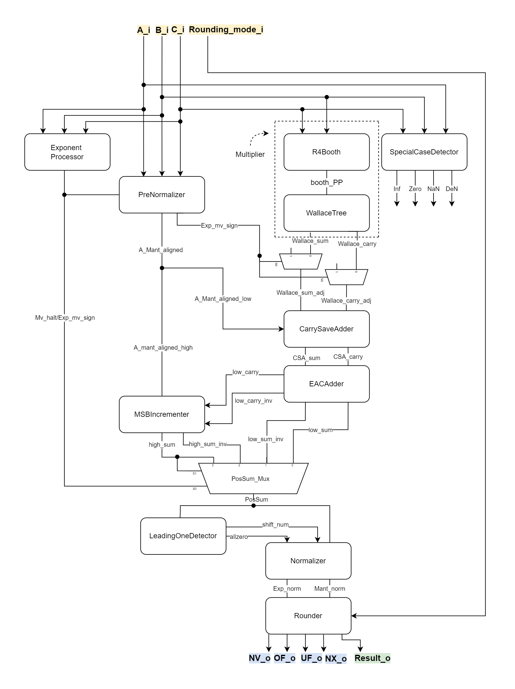

# Implementation of a RISC-V compatible Multiply-Add-Fused Unit

## Abstract
The floating-point multiply-add fused (MAF, also named Multiply Accumulate, MAC) unit is popular in modern microprocessor design due to its efficiency and performance advantages. The design aims to speed up scientific computations, multimedia applications along with trendy machine learning tasks. This study implements a MAF unit with RISC-V "F" extension compatability [1], incorporates standard IEEE 754-2008 [2] exception handling, NaN propagation and with denormalized number support. Five distinct rounding modes and accured exceptin flags are also supported in our implementation as specified. We test our design with carefully crafted corner cases and with random generated floating-point numbers to verify its correctness. Source code of the project could be found on https://github.com/hankshyu/RISC-V_MAC.

Index terms: Floating-Point Unit, Multiply-Add fused, Multiply Accumulate, RISC-V

## 1.Intorduction
Floating-point operations play a crucial rule in modern day computing, especially when the machine learning domain flourishes. The growing computational power makes training sophisticated models possible. To apply machine learning models in real life application requires the processor to operate on floating-points, which is ususally how real time data are represented. Moreover, deep learning algorithms with exhaustive need of floating-point computational capabilities like neural network grew its popularity recently, further challanging the floating-point processing power of the micorprocessor. Among all floating-point operations, add and multiply are the most demanding, the combination appears in the convolution layers of Convolutional neural networks and many other model's architecture.

Binary floating-point units are available on most microprocessors nowadays and are common even in embedded applications including game systems. Most designs center around a fused multiply-add dataflow due to its simplicity and performance advantage over separate multiply and add pipelines. It combines two basic operations with only one rounding error and shares hardware components to save chip area. Such design is also consistent with the basic RISC philosophy of heavily optimize units in order to rapidly carry out the most frequently expected function. Furthermore, the existence of fused multiply-add unit leads to more efficient superscaler cpu design since three floating-point instructions: add, multiply and fused multiply-add could be scheduled to the same functional unit.

To take full advantage of the MAF dataflow, [3] trasnforms a set of equations into a series of multiply-adds by a numerical analysis technique called Horner's rule. [4] presents a general method to convert any transform algorithm into MAF optimized algorithms. [5] presents a framework for automaticaay generating MAF code for every linear DSP transform. The above mentioned examples shows that the MAF architecture is recognized in modern computing and could receive optimization at the software level. 

## 2.Related Work
IBM RS/6000 workstation [6] in 1990 is the first processor to contain a fused multiply-add dataflow. The compact design with pipeline latency of two cycles is made possible by a fast-shifter and a novel leading-zero/one anticipator [7]. It brought the concept of fusing multiply and add operation to reduce ports, and for better compiler optimization. The design is so classic that many of the hardware implementation algorithms are still popular today. 

Later, IBM released a high-performance microprocessor optimized for commercial workloads called z990 eServer [8], also the first IBM mainframe equipped with a fused multiply-add floating-point unit [9]. It supports both the zSeries hexadecimal floating-point architecture [10] and the IEEE 754 binary floating-point archituecture [11]; furthermore, the instructions are executed in five pipeline stages. z990 eServer is not only famous for its variety of predecessors [12~17], but also for its aim to optimize binary floating-point and have a fast multiply-add execution workflow.

As when more micorprocessors starts to incorporate the ingenious MAF concept into their design, innovations for improvements also mushroomed. [18] supports multiple IEEE percisions MAF with single instruction multiple data(SIMD). The datapath is designed to execute one double-percison or two parallel single percision operations with around 20% more area and with 10% more delay. Standard operations floating-point add and floating-point multiply are performed by the MAF unit by setting multiplier 1 and addend 0. [19] proposes an archituecture permitting to skip pipeline stages to speed up the operation. The design could potentially save 2 to 3 cycles when executing a floating-point add instruction.

Floating-point computation often require high implementation cost in hardware, hence microcontroller level processors often carry out calculations with software emulation. By replacing Floating-point operations with library function call at compile time, software emulation associates with long computation time, compromised efficiency and large memory usage. [20] designs an area-optimized IEEE 754 compliant RISC-V Floating-point unit with MAF dataflow specifically for area sensitive microcontrollers, achieving 15 times speedups when compared with software emulation. 

## 3.Architecture




### 3.1. Multiplier
The design of the multiplier involvers creating a partial product array made up of multiples of multiplicand (R4Booth), and sum them up to form the product (WallaceTree). To determine to radix of the multiplier is one of the key factors in designing a fast multiplier. Chosing a smaller radix creates loads of partial products that is easy to calculate and choose from, but harder to sum due to the large quantity. On the other hand, a larger radix has fewer partial products to add from, but it's more difficut to create the partial product array. 

Radix-10 multiplication is what we are most familiar with, often carry out by hand. Decimal format is optimal for financial applications and may become more popular in the future by the publication of the revision IEEE 754 floating point standard [*1]. Binary is yet the choise for most desingers for the sake of it's mathematical properties and performance advantage.

Assume both the multiplier and the multiplicand has N bit. Radix-2, the most naive binary, would require a large counter tree to sum up N partial products. Radix-4 multiplication will reduce the number of partial product to ceil((N+1)/2), halves the number radix-2 holds. The downside is the partial product ranges from 0x 1x 2x 3x the multiplicand, 3x multiple may require extra delay and area to form since it's non-trivial.

Booth showed a technique to record digits in both positive and negative. Such transformation eliminates two cosecutive ones thus eliminates the 3x multiple. A Booth radix-4 scanning simplifies the multiples to signed 0x 1x and 2x. Under implementation, the scanning process involves examining 3 bits of the multiplier, compare it to the Modified Booth's Recording Table and determine the multiplicand selected. The logic could be simplified to the equation below:

Modified Booth's Recording Table
| Bit i + 1   |   Bit i   |   Bit i - 1   |   Multiplicand selected   |
|:------:|:----:|:----:|:----:|
|     0       |    0      |       0       |   0 x Multiplicand        |
|     0       |    0      |       1       |  +1 x Multiplicand        |
|     0       |    1      |       0       |  +1 x Multiplicand        |
|     0       |    1      |       1       |  +2 x Multiplicand        |
|     1       |    0      |       0       |  -2 x Multiplicand        |
|     1       |    0      |       1       |  -1 x Multiplicand        |
|     1       |    1      |       0       |  -1 x Multiplicand        |
|     1       |    1      |       1       |   0 x Multiplicand        |
    
```
mul1x_o = bit (i) xor bit(i - 1)
mul2x_o = bit(i+1)bit(i)bit(i-1) == (100 or 011)
mulsign_o = bit (i + 1)
```

The fact that multiplicand may be negative is disturbing because we must sign extend the multiplicand to acquire the correct result. The intuitive way is by sign extending every single bit on the left of the partial product. [*4] mentioned an elegent way of acquiring the correct result while the sign of the partial product only effects two bits of the partial product, greatly improves the potential wiring of the design and is adopted in our proposed multiplier.


The next step of multiplication is to sum the partial products, a hardware structure named Wallace tree is implemented to reduce critical path. Wallace trees are usually composed of carry save adders, also called counters. Traditionally, they intake 3 partial sums to output a sum and carry. 4;2 counters was introduced in [*5] and were further optimized and designed[*6] [*7]. By mixing the use of 3:2 counter and 4:2 counter results in an optimal design which minimizes delay.


### 3.2. PreNormalizer

Before the Addend could be add with the partial products from the multiplier, proper alignment must take place. Our design overlaps the data aligment with the early pahses of multiplication, such design requires the capability of shifting the addend in either direction while each of these partial products are two times as wide as the input. In short, by executing multiplication and alignment in parallel, we must include a large shifter about 3 times the size of the mantissa.

In a normal floating point adder, the smaller exponent is aligned; nevertheless, it is very costy to implement a large shifter capable of shifting bidirectionally. A clean and more efficient impelmentation is mentioned in [*8]. Alignment of the addend is implemented by placing the addend to leftmost of the product and shifts the addend to the right according to the exponent value. In other words, the product is treated as having a fixed radix point and the addend is aligned to the radix point. Under such implementation, the shifting ranges also approxiamtely three times the width of the data plus some guard bits but only shift-right capbilities is needed for the shifter.

After the normalization of the exponent, if the mantissa of the addend is of 24 (length of the mantissa) plus two gurad bits greater than the product, the final mantissa is solely decided by the product's mantissa thus further shifting to the left is unnecessary. When the addend's most significatn bit is less than the product's least significant bit, the mantissa of the addend dominates the result so it's needless to further shift to the right. The value of shifting is also mentioned in [*8] and is processed in the exponent processor in our design:

```
d:  the difference between the exponent of the addend and the product
mv: the shift amount of the addned for alignment

d = expA - (expB + ExpC -127)
mv = 27 - d 
```

### 3.3 End Around Carry (EAC) Adders

In an ordinary Multiply and add dataflow. The product should form before the add operation take place. However, the addend is added with the partial products comming out of the multiplier directly in our design. Such dataflow may cause a propagate of any carry outs that ought to be ignored, contaminating the final result. In other words, we should figure out whether there was a carry out of the sign extension prior to the last carry save adder, if the carry out is detected, no adjustment has to be made. On the other hand, if no carry out is detected, we must invert the result driving to the EAC Adders.

Floating points are represented as sign and magnitude format in IEEE-754. In consequence, the adder is only responsible of calculating the absolute value of the sum. However, it is very difficult to determine in advance which operand is bigger in the MAC dataflow. Even if we know which operand is greater, we would need two complementors for the sum and carry comming from the carry save adder, which is inefficient. We need an adder that always output the magnitude of the result by coditionally complement one operand. This type of adder is called an "End Around carry" adder.

The mathematical model is presented in [*9]. The logic is essentially driving the carry out of (P-B) into another adder's carry in. Such function could be implemented by two carry chains, using two adders calculating (P - B) and (B - P) respectively with a multiplexer selecting the answer of the two. [*9] also mentioned another impelmentation similar to a cary lookahead adder, which is smaller in size but harder to implement.

### 3.4 Leading One Detector

Design of the Leading One detector is pivotal to the normalization process. Normalization stips away all leading sign bits so that the two bits adjacent to the radix point are of opposite polarity. To determinte how much to shift would be the responsibility of the Leading one detector. 

Back to the first processor contains a fused multiply-add dataflow [*3], the RC/6000 processor also equipped a leading-zero anticipator (LZA) to process the leading zeros and ones in parallel with floating point addition. The algorithm is mentioned in [*10] [*11]. [*12] further compares algorithms of detecting leading zeros/ones. 

Although running one detection and addition in parallel would acclerate the calculation, the hardware area  grows significantly if the input bits grew wider. Another disadvantage of calculating the leading ones before addition is the polarity of the additon is not yet determined, the hardware must incorporate the sign of the sum to calculate the correct amount of leading ones.

An easy solution is to only implement a parts of the LZA component. Despite the fact that it would only operate when the sum is calculated, leading to a slower design. The lightweight leading one detector could assume the input is always positive, since the output of the End around carry is always positive. By taking the advantage of the know polarity, our design uses much smaller area and  simplier algorithm with great scalbility.

### 3.5 Rounder
Since floating point has a fixed sized mantissa, bits that are less significant would be naturally truncated during the operation. For user to freely select their desired rounding mode, we must add extra bits called guard bit, round bit and sticky bit during arithmatic calculations. [*13] explains why a guard bit is necessary to ensure the rounding works correctly.

RISCV "F" standard Extension supports 5 rounding modes: RNE, RTZ, RDN, RUP and RMM. IEEE754-2008[*14] clearly defines the behaviour of rounding toward a directed orientation, which is how RTZ, RDN and RUP operate. [*8] provided an easy way of implementation, simplefies 3 rounding mode into two: RI and RZ. RNE and RMM are a bit trickier, the floating point number nearest to infinty precise result is given. If the distance between two nearest floating-point are equally near, RNE delivers the one with and even least significant digit, where RMM delivers the larger magnitude. They are named as roundTiesToEven and roundTiestoAway in IEEE754-2008[*14].

The floating-point control and status register in RISC-V also holds the accrued exception flags, NV, DZ, OF, UF and NX. In the MAC dataflow, DV would never be raised so only 4 exception flags are judged in our design. Overflow and underflow flags are pretty intuitive. NV flag will be raised if any invalid operation take place. IEEE754-2008 7.2 [*14] lists invalid operations that shall be detected. NX flag stands for inexact, it would fire if the calculated result of our design does not equal to the absolute answer. By checking the contamination of the sticky bits, we could judge whether the flag shall be raise.

IEEE754-2008 also defined the default exception handling methods that we must obey. The job is also done by the rounder because rounding mode could potentially affect the way underflow or overflow represents. For example, RTZ carries positive overflow to the format's largest finite nubmer while RUP carries to positive infinity. After all the adjustments, the output from the rounder drives the output of the MAC module.

## 4.Results
A testbench program is carefully designed to test the module, including error prone border testcases. Most of the testcases are hand-carved in order to provide a strict testbench. The test could be found in a Systemverilog testbench file. The test is split into several parts:

- Invalid operations: test if the module's exception handling works.
- Infinities: test if the operations about infinities defined in IEEE754-2008 is obeyed.
- Operation with zeros: test if the operations with zero work properly.
- Overflow/Rounding: If the flags raise correctly and the output value adjusted according to the rounding mode.
- Rounding: test if supported rounding mode works well.
- Random generated numbers: Generate random float numbers to test if MAC operates as the way we want.

Our module passes all of the tests above mentioned. We plan to further test our module with exhausting torture tests and on development boards in the future.

## 5.Conclusion

## Neo_Reference
[1] “The RISC-V Instruction Set Manual, Volume I: User-Level ISA, Document Version 20191213”, Editors Andrew Waterman and Krste Asanovi ́c, RISC-V Foundation, December 2019.

[2] "IEEE Standard for Floating-Point Arithmetic," in IEEE Std 754-2008 , vol., no., pp.1-70, 29 Aug. 2008, doi: 10.1109/IEEESTD.2008.4610935.

[3] Knuth, D. “The Art of Computer Programming, Vol. 2: Seminumerical Algorithms, 3rd ed.” Addison-Wesley, Reading, MA, 1998, 467–469.

[4] Y. Voronenko and M. Puschel, "Mechanical Derivation of Fused Multiply–Add Algorithms for Linear Transforms," in IEEE Transactions on Signal Processing, vol. 55, no. 9, pp. 4458-4473, Sept. 2007, doi: 10.1109/TSP.2007.896116.

[5] Y. Voronenko and M. Puschel, "Automatic generation of implementations for DSP transforms on fused multiply-add architectures," 2004 IEEE International Conference on Acoustics, Speech, and Signal Processing, 2004, pp. V-101, doi: 10.1109/ICASSP.2004.1327057.

[6] R. K. Montoye, E. Hokenek and S. L. Runyon, "Design of the IBM RISC System/6000 floating-point execution unit," in IBM Journal of Research and Development, vol. 34, no. 1, pp. 59-70, Jan. 1990, doi: 10.1147/rd.341.0059.

[7] E. Hokenek and R. K. Montoye, "Leading-zero anticipator (LZA) in the IBM RISC System/6000 floating-point execution unit," in IBM Journal of Research and Development, vol. 34, no. 1, pp. 71-77, Jan. 1990, doi: 10.1147/rd.341.0071.

[8] T. J. Slegel, E. Pfeffer and J. A. Magee, "The IBM eServer z990 microprocessor," in IBM Journal of Research and Development, vol. 48, no. 3.4, pp. 295-309, May 2004, doi: 10.1147/rd.483.0295.

[9] G. Gerwig et al., "The IBM eServer z990 floating-point unit," in IBM Journal of Research and Development, vol. 48, no. 3.4, pp. 311-322, May 2004, doi: 10.1147/rd.483.0311.

[10] IBM Corporation, Enterprise Systems Architecture/390
Principles of Operation (SA22-7201); see http://
www.elink.ibmlink.ibm.com/public/applications/publications/
cgibin/pbi.cgi/.

[11] "IEEE Standard for Binary Floating-Point Arithmetic," in ANSI/IEEE Std 754-1985 , vol., no., pp.1-20, 12 Oct. 1985, doi: 10.1109/IEEESTD.1985.82928.

[12] G. Gerwig and M. Kroener, "Floating-point unit in standard cell design with 116 bit wide dataflow," Proceedings 14th IEEE Symposium on Computer Arithmetic (Cat. No.99CB36336), 1999, pp. 266-273, doi: 10.1109/ARITH.1999.762853.

[13] E. M. Schwarz, L. Sigal and T. J. McPherson, "CMOS floating-point unit for the S/390 Parallel Enterprise Server G4," in IBM Journal of Research and Development, vol. 41, no. 4.5, pp. 475-488, July 1997, doi: 10.1147/rd.414.0475.

[14] E. M. Schwarz, R. M. Averill and L. J. Sigal, "A radix-8 CMOS S/390 multiplier," Proceedings 13th IEEE Sympsoium on Computer Arithmetic, 1997, pp. 2-9, doi: 10.1109/ARITH.1997.614873.

[15] E. M. Schwarz and C. A. Krygowski, "The S/390 G5 floating-point unit," in IBM Journal of Research and Development, vol. 43, no. 5.6, pp. 707-721, Sept. 1999, doi: 10.1147/rd.435.0707.

[16] E. M. Schwarz, R. M. Smith and C. A. Krygowski, "The S/390 G5 floating point unit supporting hex and binary architectures," Proceedings 14th IEEE Symposium on Computer Arithmetic (Cat. No.99CB36336), 1999, pp. 258-265, doi: 10.1109/ARITH.1999.762852.

[17] E. M. Schwarz et al., "The microarchitecture of the IBM eServer z900 processor," in IBM Journal of Research and Development, vol. 46, no. 4.5, pp. 381-395, July 2002, doi: 10.1147/rd.464.0381.

[18] Chichyang Chen, Liang-An Chen and Jih-Ren Cheng, "Architectural design of a fast floating-point multiplication-add fused unit using signed-digit addition," Proceedings Euromicro Symposium on Digital Systems Design, 2001, pp. 346-353, doi: 10.1109/DSD.2001.952324.

[19] T. Lang and J. D. Bruguera, "Floating-point fused multiply-add with reduced latency," Proceedings. IEEE International Conference on Computer Design: VLSI in Computers and Processors, 2002, pp. 145-150, doi: 10.1109/ICCD.2002.1106762.

[20] Bertaccini, Luca & Perotti, Matteo & Mach, Stefan & Schiavone, Pasquale & Zaruba, Florian & Benini, Luca. (2021). Tiny-FPU: Low-Cost Floating-Point Support for Small RISC-V MCU Cores. 1-5. 10.1109/ISCAS51556.2021.9401149. 

## References


[*1]: “IEEE standard for floating-point arithmetic, ANSI/IEEE Std 754R,” The Institute of
Electrical and Electronic Engineers, Inc., In progress, http://754r.ucbtest.org/ drafts/754r.pdf .

[*2] Knuth, D. “The Art of Computer Programming, Vol. 2: Seminumerical Algorithms, 3rd ed.” Addison-Wesley, Reading, MA, 1998, 467–469.

[*3] Montoye, R.K.; Hokenek, E.; Runyon, S.L. “Design of the IBM RISC System/6000
floating-point execution unit”, IBM J. Res. Dev., 1990, 34(1), 59–70.

[*4] Appendix A Sign Extension in Booth Multipliers, http://i.stanford.edu/pub/cstr/reports/csl/tr/94/617/CSL-TR-94-617.appendix.pdf

[*5] Weinberger, A. “4:2 carry-save adder module”, IBM Technical Disclosure Bull., 1981,
23, 3811–3814.

[*6] D. Radhakrishnan and A. P. Preethy, "Low power CMOS pass logic 4-2 compressor for high-speed multiplication," Proceedings of the 43rd IEEE Midwest Symposium on Circuits and Systems (Cat.No.CH37144), 2000, pp. 1296-1298 vol.3, doi: 10.1109/MWSCAS.2000.951453.

[*7] K. Prasad and K. K. Parhi, "Low-power 4-2 and 5-2 compressors," Conference Record of Thirty-Fifth Asilomar Conference on Signals, Systems and Computers (Cat.No.01CH37256), 2001, pp. 129-133 vol.1, doi: 10.1109/ACSSC.2001.986892.

[*8] Zhaolin Li, Xinyue Zhang, Gongqiong Liz and Runde Zhou, "Design of a fully pipelined single-precision floating-point unit," 2007 7th International Conference on ASIC, 2007, pp. 60-63, doi: 10.1109/ICASIC.2007.4415567.

[*9] Schwarz, Eric. (2007). Binary Floating-Point Unit Design. 10.1007/978-0-387-34047-0_8. 

[*10] E. Hokenek and R. K. Montoye, "Leading-zero anticipator (LZA) in the IBM RISC System/6000 floating-point execution unit," in IBM Journal of Research and Development, vol. 34, no. 1, pp. 71-77, Jan. 1990, doi: 10.1147/rd.341.0071.

[*11] H. Suzuki, H. Morinaka, H. Makino, Y. Nakase, K. Mashiko and T. Sumi, "Leading-zero anticipatory logic for high-speed floating point addition," in IEEE Journal of Solid-State Circuits, vol. 31, no. 8, pp. 1157-1164, Aug. 1996, doi: 10.1109/4.508263.

[*12] M. S. Schmookler and K. J. Nowka, "Leading zero anticipation and detection-a comparison of methods," Proceedings 15th IEEE Symposium on Computer Arithmetic. ARITH-15 2001, 2001, pp. 7-12, doi: 10.1109/ARITH.2001.930098.

[*13] https://pages.cs.wisc.edu/~david/courses/cs552/S12/handouts/guardbits.pdf

[*14] "IEEE Standard for Floating-Point Arithmetic," in IEEE Std 754-2008 , vol., no., pp.1-70, 29 Aug. 2008, doi: 10.1109/IEEESTD.2008.4610935.


[*15] G. Gerwig, H. Wetter, E. M. Schwarz and J. Haess, "The IBM eServer z990 floating-point unit", IBM Journal of Research and Development, vol. 48, no. 3–4, pp. 311-322, May/July 2004.

[*15.1] T. J. Slegel, E. Pfeffer and J. A. Magee, "The IBM eServer z990 microprocessor," in IBM Journal of Research and Development, vol. 48, no. 3.4, pp. 295-309, May 2004, doi: 10.1147/rd.483.0295.

[*15.2] 2. “IEEE Standard for Binary Floating-Point Arithmetic,”
ANSI/IEEE Standard 754-1985, The Institute of Electrical
and Electronics Engineers, Inc., New York, August 1985.

[*15.3]. IBM Corporation, Enterprise Systems Architecture/390
Principles of Operation (SA22-7201); see http://
www.elink.ibmlink.ibm.com/public/applications/publications/
cgibin/pbi.cgi/.

[*15.4]. G. Gerwig and M. Kroener, “Floating-Point-Unit in
Standard Cell Design with 116 Bit Wide Dataflow,”
Proceedings of the 14th IEEE Symposium on Computer
Arithmetic, Adelaide, Australia, April 1999, pp. 266 –273.
[*15.5]. E. M. Schwarz, L. Sigal, and T. J. McPherson, “CMOS
Floating-Point Unit for the S/390 Parallel Enterprise
Server G4,” IBM J. Res. & Dev. 41, No. 4/5, 475– 488
(July/September 1997).
[*15.6]. E. M. Schwarz, R. M. Averill III, and L. J. Sigal, “A
Radix-8 CMOS S/390 Multiplier,” Proceedings of the 13th
IEEE Symposium on Computer Arithmetic (ARITH 97),
Asilomar, CA, July 1997, pp. 2–9.
[*15.7]. E. M. Schwarz and C. A. Krygowski, “The S/390
G5 Floating-Point Unit,” IBM J. Res. & Dev. 43, No. 5/6,
707–721 (September/November 1999).
[*15.8]. E. M. Schwarz, R. M. Smith, and C. A. Krygowski, “The
S/390 G5 Floating Point Unit Supporting Hex and Binary
Architectures,” Proceedings of the 14th IEEE Symposium
on Computer Arithmetic, Adelaide, Australia, April 1999,
pp. 258 –265.
[*15.9]. E. M. Schwarz, M. A. Check, C.-L. K. Shum, T. Koehler,
S. B. Swaney, J. D. MacDougall, and C. A. Krygowski,
“The Microarchitecture of the IBM eServer z900
Processor,” IBM J.

[*16] C. Chen, L.-A. Chen and J.-R. Cheng, "Architectural Design of a Fast Floating-Point Multiplication-Add Fused Unit Using Signed-Digit Addition", Proc. Euromicro Symp. Digital System Design (DSD 2001), pp. 346-353, 2001.

[*17] L. Tomas and B. Javier D, "Floating-point multiply-add fused with reduced latency", IEEE Transactions on Computers, vol. 53, no. 8, pp. 988-1003, August 2004.

[*18] E. Hokenek, R. K. Montoye and P. W. Cook, "Second-generation RISC floating point with multiply-add fused," in IEEE Journal of Solid-State Circuits, vol. 25, no. 5, pp. 1207-1213, Oct. 1990, doi: 10.1109/4.62143.

[*19] Bertaccini, Luca & Perotti, Matteo & Mach, Stefan & Schiavone, Pasquale & Zaruba, Florian & Benini, Luca. (2021). Tiny-FPU: Low-Cost Floating-Point Support for Small RISC-V MCU Cores. 1-5. 10.1109/ISCAS51556.2021.9401149. 

[*20] Y. Voronenko and M. Puschel, "Mechanical Derivation of Fused Multiply–Add Algorithms for Linear Transforms," in IEEE Transactions on Signal Processing, vol. 55, no. 9, pp. 4458-4473, Sept. 2007, doi: 10.1109/TSP.2007.896116.

[*21] Y. Voronenko and M. Puschel, "Automatic generation of implementations for DSP transforms on fused multiply-add architectures," 2004 IEEE International Conference on Acoustics, Speech, and Signal Processing, 2004, pp. V-101, doi: 10.1109/ICASSP.2004.1327057.